# 🎓 Academy of St. Joseph Claveria, Cagayan Inc. Attendance Checker


A QR-code attendance management system for a Philippine senior-high school, built on plain
**PHP 8 + MySQL 8** with no framework. Students scan an LRN-encoded QR code at a kiosk;
admin, teacher and staff accounts work from a role-gated dashboard with reports, behavior
monitoring, badges and SMS alerts. Built as a research project to modernise attendance
tracking at Academy of St. Joseph Claveria, Cagayan Inc.

## 📑 Table of Contents

- [✨ Highlights](#-highlights)
- [🖼️ Product tour](#️-product-tour)
- [🧭 Modules](#-modules)
- [👥 Roles](#-roles)
- [🛠️ Tech stack](#️-tech-stack)
- [🚀 Getting started](#-getting-started)
- [📁 Repository layout](#-repository-layout)
- [📚 Documentation](#-documentation)
- [🔒 Security](#-security)

## ✨ Highlights

- **QR + LRN attendance** — every student gets an auto-generated QR code keyed to their
  DepEd Learner Reference Number (11–13 digits, validated on input).
- **One record per student per day** — enforced in the database with a
  `UNIQUE (lrn, date)` key; scans update the same row (time-in → time-out).
- **AM/PM sessions with per-grade schedules** — automatic late flagging against
  configurable time windows, duplicate-scan suppression per session.
- **Four roles, server-side gating** — `admin`, `teacher`, `staff` sign in; students only
  ever touch the QR kiosk. Every page and API handler re-checks the role in PHP.
- **Live dashboards** — today's counters, 7-day present/absent trend, per-section donut
  chart and recent-activity feed (Chart.js).
- **Behavior monitoring** — automatic alerts for frequent lateness, consecutive absences,
  sudden absences and attendance drops, with severity levels and a CLI scheduler.
- **Badges & SMS** — 10 seeded achievement badges with a leaderboard, plus multi-gateway
  SMS (Semaphore / Twilio / Vonage) with templates and delivery logs.
- **Exports & audit trail** — section/date reports as CSV or PDF, and every admin action
  recorded with IP address in `admin_activity_log`.

## 🖼️ Product tour

Click any thumbnail for the full-size capture. All 24 screenshots, their routes and the
capture methodology are listed in [`readMeAssets/INDEX.md`](readMeAssets/INDEX.md).

| | | |
|:--:|:--:|:--:|
| [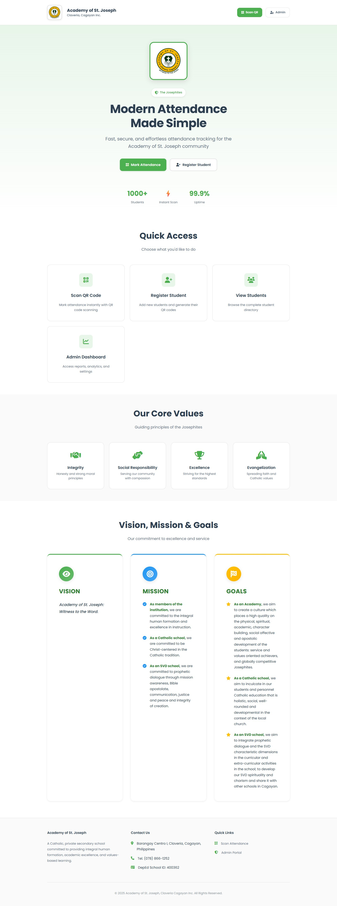](readMeAssets/01_landing.jpg)<br><sub>Public landing page</sub> | [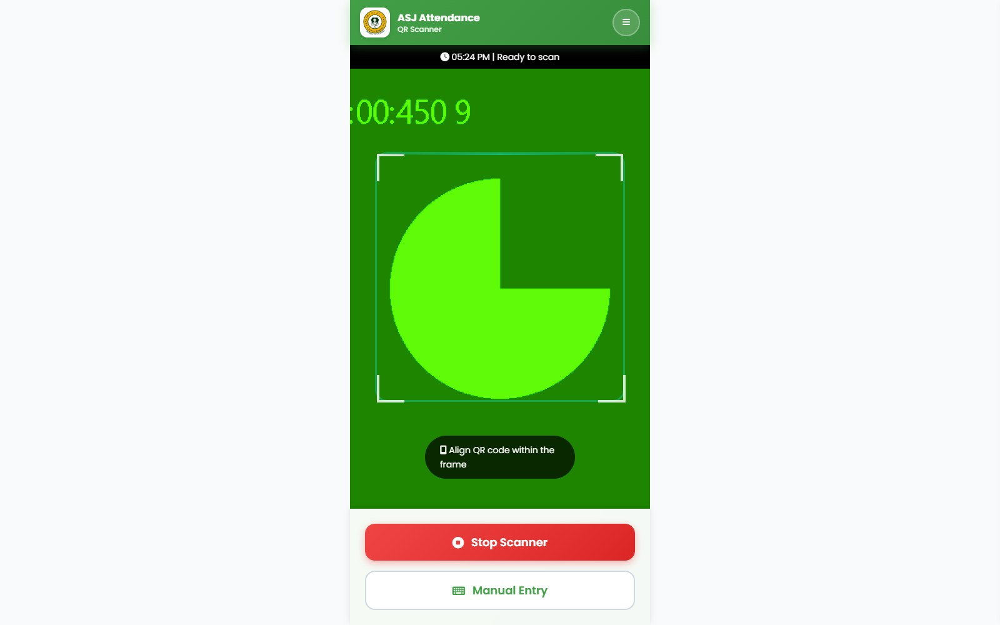](readMeAssets/02_scan_qr.jpg)<br><sub>QR scanner kiosk (live camera)</sub> | [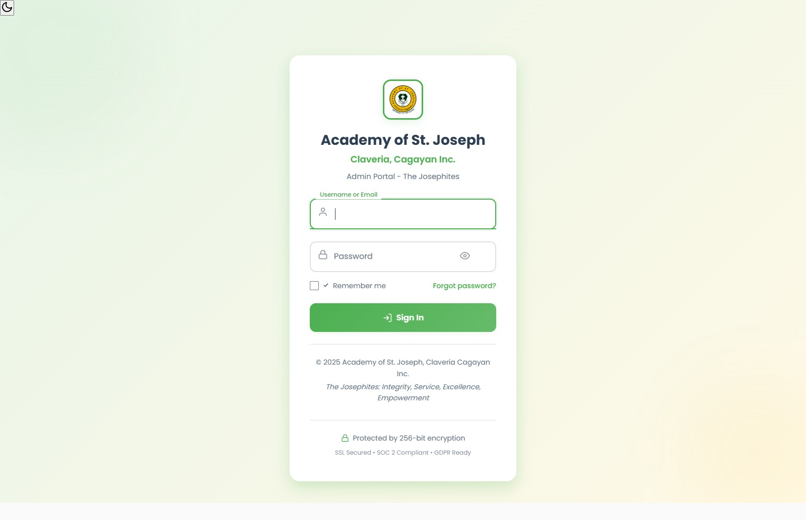](readMeAssets/03_login.jpg)<br><sub>Admin sign-in</sub> |
| [](readMeAssets/06_admin_dashboard.jpg)<br><sub>Admin dashboard — stats & charts</sub> | [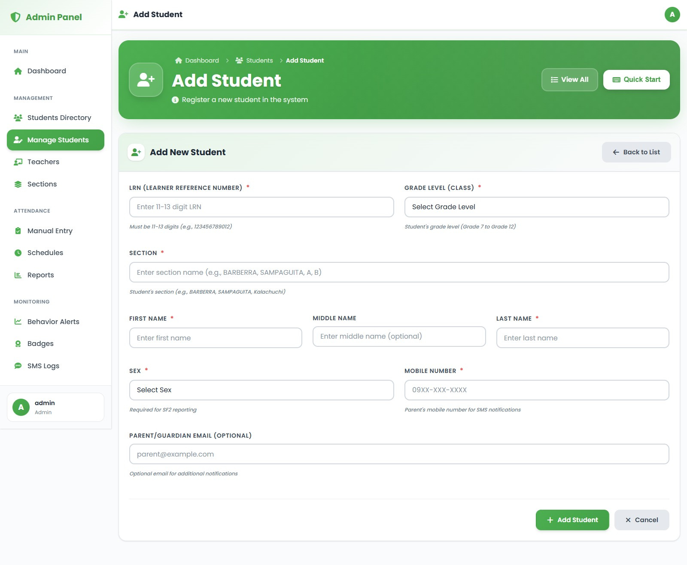](readMeAssets/07_manage_students.jpg)<br><sub>Manage students</sub> | [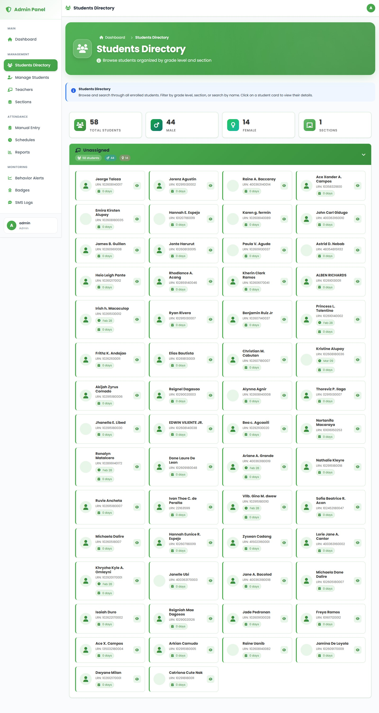](readMeAssets/09_students_directory.jpg)<br><sub>Students directory</sub> |
| [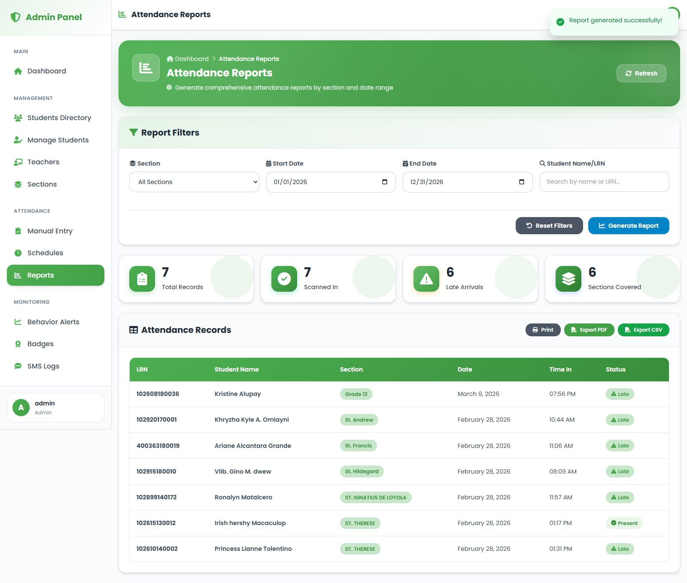](readMeAssets/14_attendance_reports.jpg)<br><sub>Attendance reports</sub> | [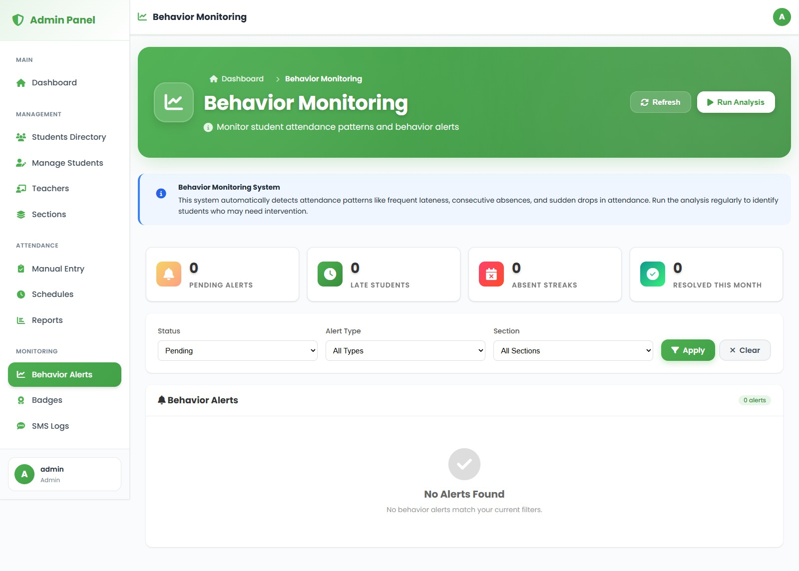](readMeAssets/15_behavior_monitoring.jpg)<br><sub>Behavior monitoring</sub> | [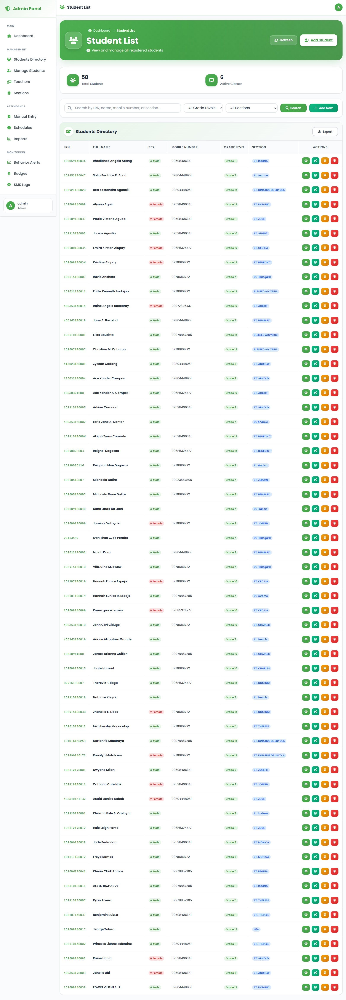](readMeAssets/17_students_table.jpg)<br><sub>Students table</sub> |
| [](readMeAssets/18_teacher_dashboard.jpg)<br><sub>Teacher dashboard</sub> | [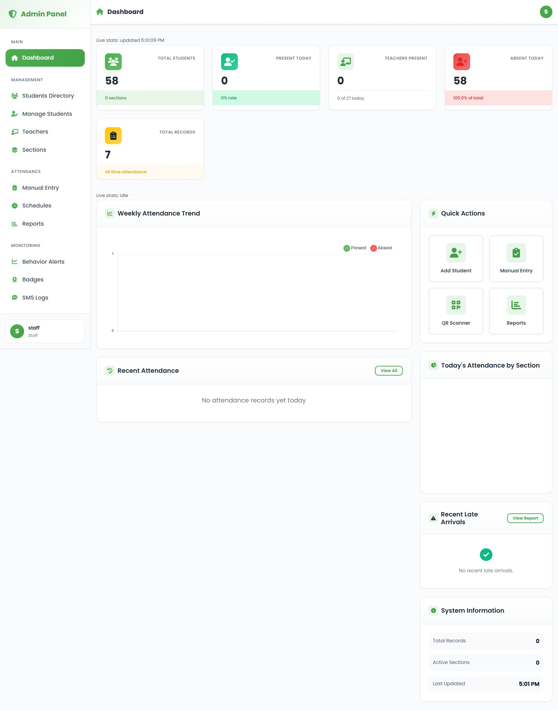](readMeAssets/21_staff_dashboard.jpg)<br><sub>Staff dashboard</sub> | [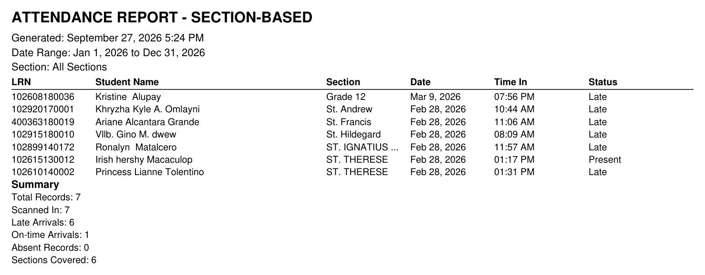](readMeAssets/23_export_attendance_pdf.jpg)<br><sub>PDF export</sub> |

## 🧭 Modules

| Module | What it does | Key files |
|--------|--------------|-----------|
| Public site & kiosk | Landing page plus a full-screen scanner that marks attendance from an LRN QR code (ZXing) | `index.php`, `scan_attendance.php` |
| Auth & recovery | Session login, remember-me, 5-attempt/15-minute lockout, e-mailed reset tokens with expiry | `admin/login.php`, `admin/forgot_password.php`, `admin/reset_password.php`, `api/request_password_reset.php`, `api/update_password.php` |
| Dashboard | Live counters, 7-day trend, section donut, activity feed and "needs attention" list | `admin/dashboard.php`, `api/get_dashboard_stats.php`, `admin/api/dashboard_stats.php` |
| Student records | CRUD with LRN validation (11–13 digits), auto QR generation, section filtering, bulk operations | `admin/manage_students.php`, `admin/students_directory.php`, `admin/view_students.php` |
| Sections & schedules | Grade/section management with advisers and school year; AM/PM schedule windows per grade | `admin/manage_sections.php`, `admin/manage_schedules.php` |
| Attendance marking | Single and bulk manual entry with an integrated scanner, AM/PM sessions, late flags | `admin/manual_attendance.php`, `api/mark_attendance.php` |
| Reports & exports | Date-range and section filters, summary cards, CSV and PDF output | `admin/attendance_reports_sections.php`, `api/export_attendance_sections_csv.php`, `api/export_attendance_sections_pdf.php` |
| Teachers & faculty attendance | Teacher records with employee numbers and an independent daily table (`UNIQUE employee_number, date`) | `admin/manage_teachers.php`, `teacher_attendance` |
| Behavior monitoring | Detects frequent lateness, consecutive/sudden absences and attendance drops; severity levels, acknowledgement, CLI scheduler | `admin/behavior_monitoring.php`, `scripts/run_behavior_analysis_cli.php` |
| Badges & leaderboard | Automatic and manual award of 10 badge types with points and rankings | `admin/manage_badges.php`, `badges`, `user_badges` |
| SMS notifications | Semaphore / Twilio / Vonage gateways, template management, rate limits, delivery log | `admin/sms_logs.php`, `config/sms_config.php`, [`ANDROID_SMS_SETUP.md`](ANDROID_SMS_SETUP.md) |
| Audit trail | Every admin action stored with actor, IP address and timestamp | `admin_activity_log` |

## 👥 Roles

| Role | Who signs in | Access (server-enforced) |
|------|--------------|--------------------------|
| **admin** | School administrator | All 15 screens: students, sections, schedules, teachers, badges, SMS, manual entry, reports, exports |
| **teacher** | Faculty adviser | Dashboard, students directory, behavior monitoring, report exports |
| **staff** | Clerical / registrar support | Dashboard, students directory |
| **student** | Pupil at the kiosk | No login — scans their own QR code only |

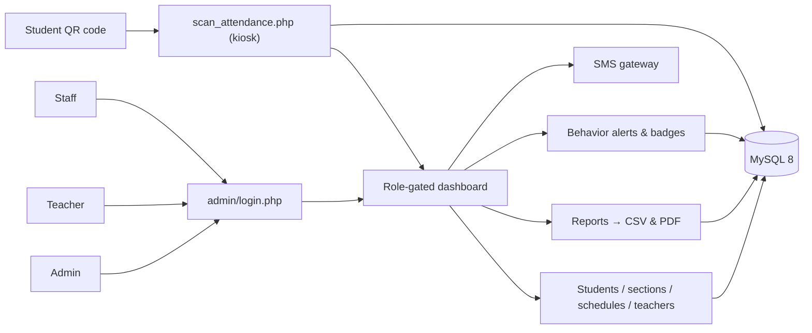

## 🛠️ Tech stack

| Layer | Choice | Evidence in this repo |
|-------|--------|-----------------------|
| Language | Plain PHP 8.0+ (no framework) | 67 PHP files, ~26.5K lines, file-based routing via `admin/`, `api/` |
| Database | MySQL 8, PDO with emulated prepares disabled | 17 tables, 218 `->prepare(` calls, `new PDO` in `config/db_config.php` |
| Front end | Vanilla JS + custom CSS design system | 5 JS files, 11 CSS files, CSS variables / gradient themes |
| Charts & motion | Chart.js, AOS | `admin/includes/header_modern.php`, `index.php` |
| QR scanning | ZXing (`@zxing/library` via CDN) | `scan_attendance.php` |
| Mail | PHPMailer (vendored) | `libs/PHPMailer/` |
| PDF / CSV | Hand-rolled `SimplePdf` writer + native CSV export | `api/export_attendance_sections_pdf.php` (no TCPDF dependency) |
| Timezone | Asia/Manila | `config/db_config.php` |
| Tooling | Test script, behavior-analysis CLI, Puppeteer screenshot harness | `scripts/test_all.php`, `scripts/run_behavior_analysis_cli.php`, `scripts/screenshot.mjs` |

## 🚀 Getting started

**Requirements:** PHP 8.0+ with `pdo_mysql` and `gd`, MySQL 8.0+, Apache (XAMPP/WAMP) or
the PHP built-in server, and a camera-capable browser for the scanner.

1. **Create and load the database**

   ```sql
   CREATE DATABASE asj_attendease_db2 CHARACTER SET utf8mb4 COLLATE utf8mb4_unicode_ci;
   ```

   ```bash
   mysql -u root -p asj_attendease_db2 < "database/asj_attendease_db (use).sql"
   ```

   The dumps in [`database/`](database/) and [`database_exports/`](database_exports/) are
   phpMyAdmin exports (no `CREATE DATABASE` inside); `(use).sql` is the fullest seed —
   58 students, 27 teachers, 18 sections, 10 badges.

2. **Configure credentials.** The app reads `DB_HOST`, `DB_USER`, `DB_PASS`, `DB_NAME`
   (plus SMTP/SMS keys) from environment variables first, then from
   `config/secrets.local.php`:

   ```php
   // config/secrets.local.php
   return [
       'DB_HOST' => 'localhost',
       'DB_USER' => 'root',
       'DB_PASS' => 'your-password',
       'DB_NAME' => 'asj_attendease_db2',
   ];
   ```

   Keep real values out of git — see [Security](#-security).

3. **Run it.** Either drop the folder into `htdocs/` and start Apache + MySQL, or serve
   the repo root directly:

   ```bash
   php -S localhost:8000
   ```

4. **Sign in.** Open `http://localhost:8000/admin/login.php`. The seed creates one `admin`
   account whose initial password is stored hashed in the dump — **change it on first
   login**. Teacher and staff accounts come from the `admin_users` seed rows.

## 📁 Repository layout

```
Academy-of-St.Joseph-Claveria-Cagayan-Inc.-Attendance-Checker/
├── index.php                    # Public landing page (AOS animations)
├── scan_attendance.php          # Full-screen QR scanner kiosk
├── admin/                       # 17 PHP pages — auth, dashboards, CRUD, reports
│   ├── includes/                # header/footer + Chart.js wiring
│   └── api/dashboard_stats.php  # Role-checked dashboard data
├── api/                         # 17 JSON handlers behind api/bootstrap.php
├── config/                      # db_config.php, sms/email config, secrets.local.php
├── includes/                    # PDO database class, QR helper, navigation
├── css/  js/                    # 11 stylesheets, 5 scripts
├── libs/PHPMailer/              # Vendored mail library
├── database/                    # Seed dumps + schema migrations
├── database_exports/            # Additional snapshots
├── scripts/                     # test_all.php, behavior CLI, screenshot.mjs
├── uploads/qrcodes/             # Generated QR images
├── readMeAssets/                # 24 screenshots + INDEX.md manifest
└── *.md                         # SETUP, flowcharts, scheduler & SMS guides
```

## 📚 Documentation

| Document | Contents |
|----------|----------|
| [`readMeAssets/INDEX.md`](readMeAssets/INDEX.md) | Screenshot manifest (route + role per image), capture methodology, **known issues** |
| [`SETUP.md`](SETUP.md) | Installation and configuration reference |
| [`GENERAL_PROCEDURE_FLOWCHART.md`](GENERAL_PROCEDURE_FLOWCHART.md) | System and procedure flowcharts |
| [`BEHAVIOR_ANALYSIS_SCHEDULER.md`](BEHAVIOR_ANALYSIS_SCHEDULER.md) | Setting up the scheduled behavior-alert job |
| [`ANDROID_SMS_SETUP.md`](ANDROID_SMS_SETUP.md) | Android/Semaphore SMS gateway setup |
| [`database/`](database/) | Schema dumps and incremental migrations |

**Regenerate the screenshots** (headless Chrome, Puppeteer):

```bash
node scripts/screenshot.mjs pilot     # public pages
node scripts/screenshot.mjs admin     # admin pages
node scripts/screenshot.mjs teacher   # teacher role
node scripts/screenshot.mjs staff     # staff role
node scripts/screenshot.mjs exports   # CSV/PDF exports
```

Latest verification: 24/24 images present, manifest ↔ files match in both directions,
0 near-blank captures.

## 🔒 Security

**Implemented**

- Session authentication with `session_regenerate_id()` on login.
- Role checks in PHP on every gated page (`requireRole()` / `requireAdmin()`) and on the
  API layer (`api_require_roles()` in `api/bootstrap.php`).
- Brute-force lockout: 5 failed attempts → 15-minute block (`admin/login.php`).
- PDO prepared statements throughout (218 `->prepare(` calls; emulated prepares off).
- CSRF token helpers (`generateCSRFToken()` / `verifyCSRFToken()`) verified on
  state-changing forms such as behavior monitoring.
- Passwords hashed with `password_hash(PASSWORD_DEFAULT)` on reset; login verifies bcrypt
  and falls back to the legacy MD5 seed hash.
- Reset tokens with expiry timestamps; output escaping with `htmlspecialchars()` (140 uses).
- Full audit trail (`admin_activity_log`) with actor, action, IP and timestamp.

**Known gaps** (details and reproductions in [`readMeAssets/INDEX.md`](readMeAssets/INDEX.md#known-issues--deliberate-exclusions))

- Password reset is broken on a fresh install: the code queries
  `reset_token_expires_at` while every dump defines `reset_token_expires`.
- Dead links: `admin/attendance_reports.php` (404, still referenced from
  `manage_students.php`) and `admin/my_attendance.php` (404, in the nav menu).
- `config/secrets.local.php` is tracked by git — untrack it and rotate the values before
  any public release.
- CSRF is not applied to every form; the legacy seed password is MD5; no CSP/HSTS headers
  yet (`.htaccess` only disables directory listing and `X-Powered-By`).

---

Developed for educational use. If you modify or build on it, keep the attribution.
